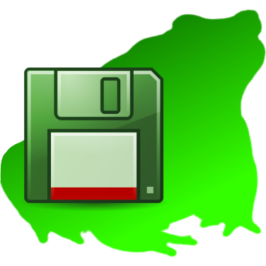

<h1>

FrogBackup
</h1>

Small TUI frontend for [Restic](https://github.com/restic/restic) with (or without) [Rclone](https://github.com/rclone/rclone) to backup files manually, but efficiently.

## Features
- Backup files and folders, and display changes between the two last snapshots
- Quick option to delete latest snapshot and restart task, if anything goes wrong
- Supports multiple backup tasks (one at a time)
- Supports pruning old snapshots (configurable value)

## Installation and use
Download the package for your operating system under [Releases](https://github.com/riomccloud/frogbackup/releases/latest). Extract and edit the `config.yaml` file according to your needs. It's also a template, just follow it.

Of course, you need Restic (and Rclone, if you want to use it alongside Restic) installed and in the enviroment variables.

## Building
The versions in Releases were made using [PyInstaller](https://pyinstaller.org), without custom arguments, except for the custom icon. You can also use FrogBackup in its original .py format, but you need to install the dependencies listed in the beginning of the Python file.

## Contributing
You can contribute reporting issues and creating pull requests, both to add new features and translate FrogBackup to other languages. I'm still a newbie, I appreciate suggestions!
